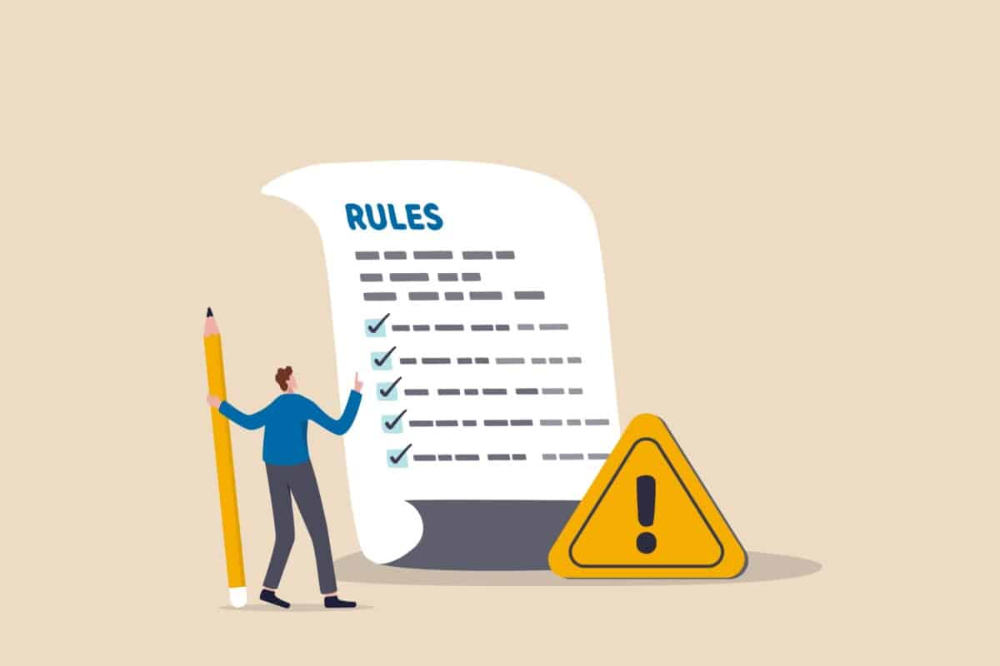

# Règles de gestion

# Un profile membre

- Le profil contient un prenom
- Le profil contient un nom
- Le profil contient une photo (facultatif)
- Le profil contient une adresse mail, qui sera utilisée pour la communication et la récupération de compte
- Le profil contient un mot de passe sécurisé pour l'authentification

# Gestion authetification

- Authentification sécurisée avec mot de passe
- Sessions sécurisées avec expiration automatique après inactivité de 2 semaines
- Reconnexion pour les actions sensibles

# Gestion de la subscription

- L'utilisateur doit s'abonner pour accéder à des fonctionnalités avancées
- La gestion des paiements doit être sécurisée
- Le payment est debité automatiquement chaque mois
- L'utilisateur peut annuler l'abonnement à tout moment via leur profil

# Gestion de reservations
- Un adherant peut réserver des terrains en précisant le sport, la disponibilité horaire et le niveau de jeu
- La reservation doit être fait au moins 24 heures à l'avance
- L'utilisateur doit être abonnée au club pour reserver un terraine
- L'utilisateur peut réserver des terrains à des horaires disponibles
- L'utilisateur ne peut avoir plus d'une réservation pour le même créneau horaire
- Le système doit afficher la disponibilité en temps réel des terrains

# Gestion d'annulations
- Une réservation peut être annulée jusqu'à 24 heures avant l'heure prévue
- En cas de trois annulations sans respecter le délai de préavis de 24 heures, une sanction sera appliquée. Cette sanction interdira à l'utilisateur de faire de nouvelles réservations pendant une semaine

# Gestion notifications
-  Lorsqu'un membre est sélectionné comme partenaire potentiel, il reçoit une notification par email l'informant qu'un autre membre lui propose un match
- L'utilisateur reçoit une notification par email pour acepter la réservation d'un terrain
- L'utilisateur reçoit une notification par email pour confirmer la réservation d'un terrain
- L'utilisateur reçoit une notification par email en cas d'annulation de sa réservation
- L'utilisateur reçoit une notification par email de rappel de match 12 heures avant la réservation

# Une notification

- Une notification est constitue de un titre
- Une notification contient un message détaillant l'événement
- Une notification concernant une réservation doit inclure la date, l'heure du match, ainsi que le nombre et le nom de l'adversaire

# Systeme de matching

- Contient une liste de partenaires disponibles pour un match
- L'algorithme de matching tiennent compte des évaluations, de la disponibilité, le niveau de jeu et des préférences sportives pour optimiser les propositions de match

# Confirmation de réservation
-  Lorsque les horaires de disponibilité de deux membres coïncident, le système propose automatiquement la première plage horaire disponible qui concorde
- Confirmation mutuelle nécessaire pour finaliser la réservation
- Une fois la réservation confirmée par les deux parties, chacun reçoit une notification finale confirmant le lieu, la date et l'heure du match

# Gestion de notation de partenaire

- Chaque notation doit être reliée à un membre
- Un membre peut accumuler plusieurs notations
- Une notation est ajoutée après chaque match
- L'membre peut donner une note allant de 1 à 5 étoiles, 5 étant la meilleure évaluation possible.
- La moyenne des étoiles de chaque joueur sera affichée à côté de son nom sur la liste de matchmaking
- Les scores moyens de notation influenceront les propositions de matching

# Bannir un jouer

- Un bouton "Bannir le Joueur" doit être inclus à côté de chaque joueur listé dans les suggestions du système de matching
- Lorsqu'un membre clique sur le bouton "Bannir le Joueur", une fenêtre pop-up de confirmation doit apparaître
- Le membre doit sélectionner la raison du bannissement parmi une liste d'options prédéfinies

# Profile administrateur
- Un administrateur peut créer des reservations de terrains
- Un administrateur peut annuler des reservations de terrains
- Un administrateur peut consulter les statistiques