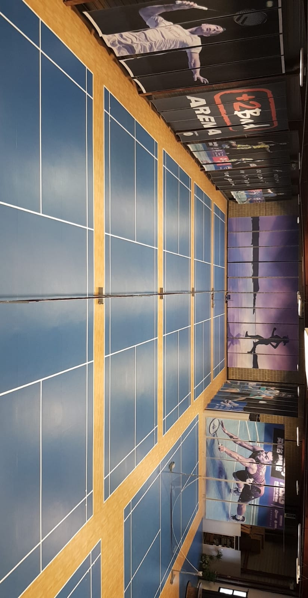
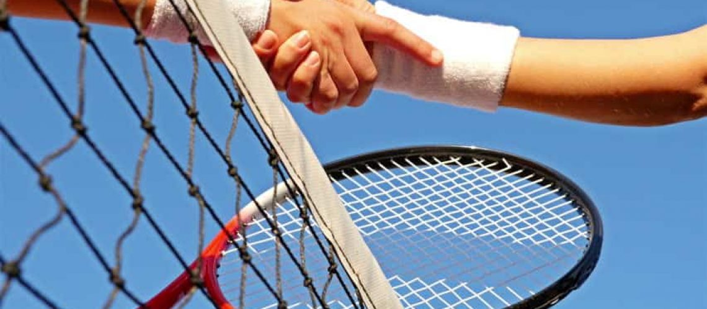
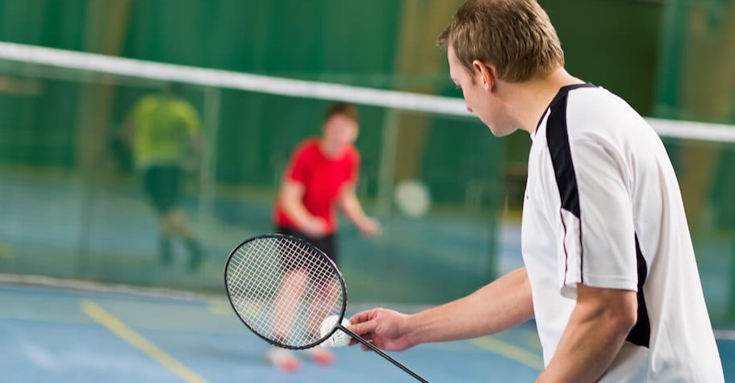
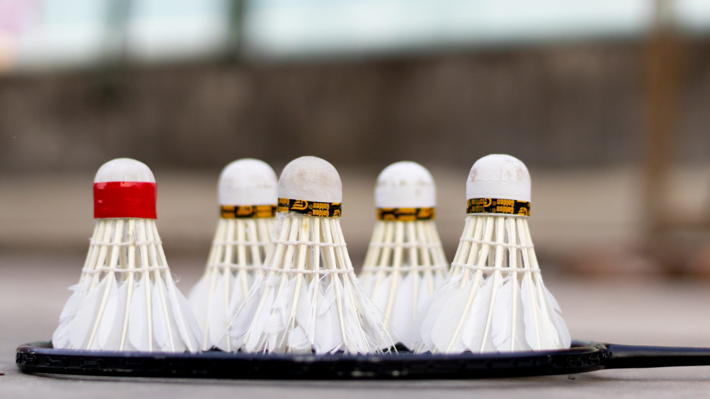

# Contexte

Le Bad's Club, situé dans le 7ème arrondissement de Lyon à proximité de la station de métro Jean Macé, est un espace sportif et lounge de plus de 1500m2 entièrement réhabilité. Avec ses 4 terrains de badminton, 5 terrains de squash et 4 terrains de tennis de table, le club propose des activités sportives variées pour tous les niveaux.

Le lieu est idéal pour partager une session de sport et de détente ou organiser des tournois sportifs.

Les réservations des terrains et la fidélisation des clients sont des enjeux majeurs pour les finances du club.
En offrant une expérience de réservation simplifiée et en permettant aux adherants d'améliorer leur niveau de jeu grâce à la recherche de partenaires de jeu adaptés, le Bad's Club pourra se démarquer de la concurrence et fidéliser ses cients.
Entant donné qu’il s’aggit des sports collectives de raquette, permetre au gens de trouver des partenaires de jeux est un element crucial pour se type de stabisement. L'application permettra de répondre à ces enjeux tout en offrant une expérience de sport complète et agréable pour ses membres.

Cependant, trouver un partenaire de jeu peut parfois être un obstacle pour les clients souhaitant réserver un terrain. Pour cela il est cruciel d’offrir aux clients une solution qui leur facilitera la recherche de partenaires de jeu et ainsi, se démarquer de la concurrence et insiter les adherants à revenir régulièrement.

En proposant une expérience de réservation fluide et en offrant la possibilité aux adherants de trouver des partenaires de jeu adaptés à leur niveau, le Bad's Club pourra se différencier de la concurrence et fidéliser sa clientèle.

# 👥 Identification de l'équipe en charge du projet

L'équipe est constituée de 2 membres :
- **MADDELEIN Jean-Benoit** qui a le rôle de Product Ownerdont la fonction est entre autre de prendre en charge les interactions entre l'équipe en charge du projet et le client.

- **GONZALEZ CAMARGO Ximena** qui a le rôle de Scrum Master dont la fonction est de diriger les membres de l'équipe en charge du projet et d'assigner des tâches à chacun.

Nous travaillons donc en Méthode Agile (SCRUM) qui est une méthodologie utilisée au sein des entreprises dans la majorité des cas.

Note : Le **Product Owner** ainsi que le Scrum Master aient également pour rôle de développer, certaines responsabilités sont propres à ces rôles spécifiques.

# 📝 Proposition de stratégie d'amélioration de reservations du club sportif Bad's

Dans le cadre de ce projet, notre équipe a effectué un travail de recherche et d'analyse pour concevoir des solutions aux différents défis rencontrés par les administrateurs et les propriétaires du club sportif Le Bad's Club dans la gestion des réservations de terrains. Nous avons tout d'abord discuté avec eux pour identifier clairement les problèmes rencontrés dans la gestion des réservations.

Ensuite, nous avons réfléchi à des solutions pour améliorer ces différents défis en utilisant des outils d'analyse. Notre proposition stratégique se concentre sur l'utilisation d'une application de réservation de terrains pour simplifier la gestion des réservations et offrir une expérience client plus fluide et efficace.

Notre analyse et notre proposition de stratégie sont détaillées dans ce document. 

## 👁‍🗨 Identification des problèmes et de potentielles solutions

| Problématiques                                            | Problèmes                                                                 | Solution                                                                                                   |
|-----------------------------------------------------------|---------------------------------------------------------------------------|------------------------------------------------------------------------------------------------------------|
| Gestion inefficace des réservations de terrains sportifs  | Difficulté pour les administrateurs du club à suivre l'utilisation des terrains et leurs disponibilités | [Mettre en place un système de réservation via une application mobile](#inefficient-management)           |
| La recherche de partenaires de jeux : un obstacle à la reservation de terrains | Difficultés pour trouver des partenaires de jeu ayant un niveau similaire et des disponibilités horaires compatibles | [Développer des algorithmes de matching avancés qui prennent en compte les préférences individuelles des utilisateurs](#challenges-finding-partners) |
| La recherche de partenaires de jeux : un obstacle à la reservation de terrains | Concrétiser l’organisation des parties                                     | [Lorsqu’un partenaire potentiel est trouvé, les deux utilisateurs reçoivent une notification. Chacun doit confirmer la réservation](#matches-organization) |
| La recherche de partenaires de jeux : un obstacle à la reservation de terrains | Savoir lorsqu’une réservation est confirmée ou annulée                     | [Envoyer une notification à l’utilisateur](#reservation-confirmed-cancelled)                               |
| La recherche de partenaires de jeux : un obstacle à la reservation de terrains | Évaluation des partenaires de jeu              | [Mettre en place une option pour qualifier le partnenaire post-match en question](#player-rating)                   |

## 👩🏻‍💻 Difficulté pour les administrateurs du club à suivre l'utilisation des terrains et leurs disponibilités

Au cours de discussions avec les administrateurs du club, nous avons identifié une problématique majeure : les difficultés à suivre l'utilisation des terrains et leurs disponibilités. Cette situation peut entraîner des conflits de réservation, une mauvaise gestion des installations sportives et une insatisfaction des membres du club. Il est essentiel pour un club de connaître en temps réel les disponibilités des terrains de jeu afin de pouvoir offrir un bon service à la clientèle et de répondre efficacement aux demandes de réservation.

Pour résoudre cette problématique, nous avons réfléchi à la création d'une application mobile dédiée au club. L'administrateur du club peut accéder à l'application de réservation de terrains via une interface dédiée, qui comprend une section réservée aux réservations. Cette section affiche une liste de toutes les réservations effectuées par les membres du club et les administrateurs, avec des informations détaillées sur chaque réservation, telles que le nom du client, le terrain réservé, la date et l'heure de la réservation.

L'interface de l'application permet également à l'administrateur d'avoir accès à la liste de toutes les réservations effectuées, avec la possibilité de filtrer et de trier les réservations en fonction de différents critères, tels que la date, l'heure, le terrain, etc.

En somme, l'application de réservation de terrains peut être conçue pour automatiser le processus de réservation et réduire la charge de travail de l'administrateur, tout en offrant une interface conviviale et facile à utiliser pour les utilisateurs.
Les administrateurs pourront accéder à une liste de clients pour avoir un suivi plus détaillé de leurs adhérents. Cette liste de clients sera accessible depuis l'interface de l'application, et permettra aux administrateurs de visualiser les informations de chaque client. La liste de clients dans l'application de réservation de terrains sportifs sera un outil essentiel pour les administrateurs, leur permettant de personnaliser leur approche envers chaque adhérent, d'améliorer la qualité du service offert par le club, et de renforcer la fidélité des clients envers le club.

## 🔎 Difficultés pour trouver des partenaires de jeu ayant un niveau similaire et des disponibilités horaires compatibles

Au cours de nos échanges avec le personnel administratif du club, nous avons constaté que de nombreux adhérents ne réservent pas de terrains, bien qu'ils soient motivés pour jouer. Le club Bad's dispose de différents terrains pour pratiquer trois sports de raquette en intérieur : le badminton, le squash et le tennis de table. En effet, les terrains du club sont principalement destinés à la pratique de sports en couple, et le manque de partenaire peut dissuader certains clients de réserver.

Pour remédier à cette situation, nous proposons de développer un système de matching pour aider les adhérents à trouver un partenaire de jeu. Ce système permettra aux joueurs de se connecter avec d'autres joueurs ayant des niveaux et des intérêts similaires ainsi que des horarires compatibles. Les adhérents devront créer un compte sur l'application, ce qui leur permettra de définir leurs préférences dans leur profil. 
Ils pourront ainsi choisir le(s) sport(s) qu'ils souhaitent pratiquer, le(s) niveau(x) de jeu des partenaires ainsi que leurs horaires de disponibilité. Pour un système plus efficace il faudra inciter les adhérents à élargir le plus possible leurs critères, notamment leurs préférences en termes de niveau et d'horaires, afin d'optimiser le système en boostant les probabilités de matches et ainsi de leur proposer un maximum de réservations. Pour cela, nous mettrons en place des popup encourageant les adhérents à élargir au maximum leurs critères. Le popup pourrait être un message précisant que plus les critères sont larges, plus il y a de chances de trouver des adversaires.

Grâce à ce système de matching, les adhérents pourront trouver facilement un partenaire de jeu. De plus, cela encouragera les adhérents à pratiquer leur sport favori plus régulièrement, ce qui contribuera au développement économique de la structure. En effet, cette solution simpliefira la reservation des terrains et augmentera par consequent le nombre de reservations.

En somme, le développement d'un système de matching pour trouver un partenaire de jeu est une solution efficace pour encourager les adhérents à réserver des terrains et à pratiquer leur sport favori plus régulièrement. Cela permettra également de renforcer la communauté du club, de favoriser les échanges entre les membres et d'attirer de nouveaux adhérents.

## 🎯 Concrétiser l’organisation des parties

Dans le club, les adhérents réservent généralement des terrains pour jouer avec un partenaire régulier. Pour les adhérents qui n'ont pas encore de partenaire de jeu et souhaitent réserver un terrain, comme mentionné précédemment, notre application propose un algorithme de matching pour les aider à trouver un partenaire potentiel. Lorsqu'un partenaire potentiel est trouvé, l'adhérent reçoit une notification pour lui proposer de jouer avec cette personne. Si l'adhérent accepte la proposition, l'application enverra une notification au partenaire potentiel pour confirmer s'il est toujours intéressé par la réservation d'un terrain.
De plus pour garantir la disponibilité du terrain, nous recommandons que la réservation soit effectuée au moins 8 jours à l'avance. Cette mesure permettra également aux adhérents de s'organiser plus facilement et de planifier leur partie en conséquence.

Cette fonctionnalité permettra de concrétiser les parties, d'aider les adhérents à améliorer leur niveau de jeu et de renforcer la communauté du club. En effet, en trouvant des partenaires de jeu compatibles, les adhérents pourront jouer plus régulièrement et progresser plus rapidement. De plus, cela favorisera les échanges entre les membres du club et permettra de créer de nouvelles connexions. Enfin, cela pourra attirer de nouveaux adhérents qui cherchent à jouer avec des partenaires de niveau similaire, ce qui contribuera à la croissance et à la vitalité du club.

## 🔔 Savoir lorsqu’une réservation est confirmée ou annulée

Dans l'état actuel des choses, il est possible qu'il y ait une erreur humaine lors de la mise à jour du statut d'une réservation pour le club, car celui-ci ne dispose pas d'un système de gestion des réservations.

Pour résoudre ce problème, notre application permettra à la fois aux adhérents et aux administrateurs de visualiser le statut de la réservation en temps réel.

Les états de la réservation seront les suivants :

- En attente de confirmation
- Confirmée
- Annulée

Connaître l'état de la réservation en temps réel permettra aux utilisateurs de savoir si leur réservation a bien été prise en compte et s'ils peuvent compter sur le terrain réservé pour jouer leur partie, ce qui leur évitera des déplacements inutiles au club dans le cas où la réservation aurait été annulée ou modifiée. En outre, cela permettra aux adhérents de mieux s'organiser et de planifier leur emploi du temps en fonction de la disponibilité du terrain. Enfin, cela contribuera à renforcer la confiance des utilisateurs envers le club et l'application, en leur offrant une expérience utilisateur plus transparente et fiable.

En ce qui concerne la gestion des annulations, nous avons décidé d'adopter une politique stricte afin d'encourager les joueurs à honorer leurs réservations.

Cette mesure vise à prévenir les annulations de dernière minute et à garantir que les terrains soient utilisés de manière optimale. Nous pensons que cela encouragera les joueurs à être plus responsables dans leurs réservations et à respecter les autres membres du club.

## 👍 Évaluation des partenaires de jeu

Pour améliorer les interactions entre joueurs, nous introduisons une fonctionnalité de "like" ou "dislike" après chaque match dans notre application. À la fin de chaque partie, les joueurs pourront évaluer leurs partenaires, influençant ainsi les recommandations futures du système de matching.

Cette évaluation permettra de personnaliser et d'améliorer la sélection des partenaires, tout en favorisant un environnement sportif positif et respectueux. Les "dislikes" répétés serviront à identifier les comportements inappropriés, permettant d'agir efficacement pour préserver la qualité et la sécurité de la communauté sportive.

Cette fonctionnalité vise à donner aux joueurs un contrôle plus direct sur leurs expériences et à promouvoir des interactions enrichissantes au sein du club.

# 👤 Identification des personas

## 🙋 La persona visiteur

Agé de 18 à 45 ans et plus, le persona visiteur, indépendamment de son sexe ou de son genre, a un intérêt marqué pour les sports de raquette.
Ce visiteur utilise régulièrement des smartphones et des applications mobiles, bien qu'il ne soit pas un expert en technologie.
L'intérêt principal du visiteur réside dans la consultation des disponibilités des terrains sportifs, motivé par une passion pour le sport ou la découverte de nouvelles activités de loisir.
Toutefois, pour concrétiser sa réservation, il découvrira la nécessité de s'inscrire, de créer un profil et de s'abonner via un paiement mensuel.
Bien que son intention initiale ne soit pas directement l'inscription, la facilité de réservation et le désir de garantir son accès aux terrains peuvent le motiver à devenir adhérent.

## 🤾🏻‍♂️ La persona adherant

La persona adhérent hérite des caractéristiques de la persona visiteur.
L'adherant est un visiteur qui a créé son profil, s'est inscrit au club et a payé l'abonnement mensuel.
Il se distingue par son engagement actif et sa passion pour les sports de raquette.
Sa priorité est de réserver et, si nécessaire, d'annuler des terrains, facilitant ainsi une pratique sportive régulière et adaptée à son emploi du temps.
La persona adhérant il souhaite trouver facilement des partenaires de jeu correspondant à son niveau et son sport de prédilection.

## 👨🏻‍💻 La persona administrateur

L'administrateur est un homme âgé d'une quarantaine d'années.
Ce persona cherche à optimiser la gestion de son club, en développant des services pour satisfaire au mieux sa clientèle.
Il est à l'aise avec l'informatique.
Il utilise déjà des outils de gestion, qui ne sont pas performants et qui ne répondent pas à ses besoins.